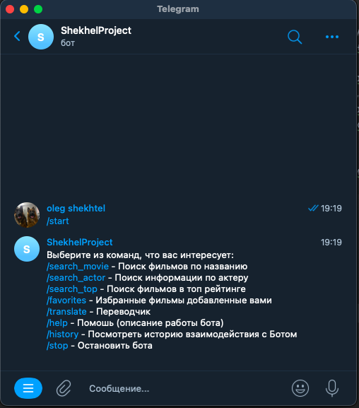
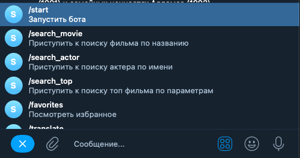
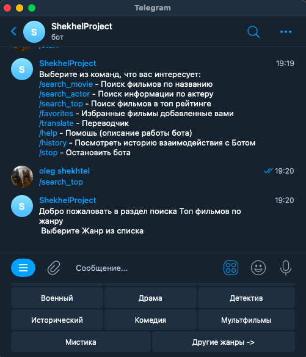
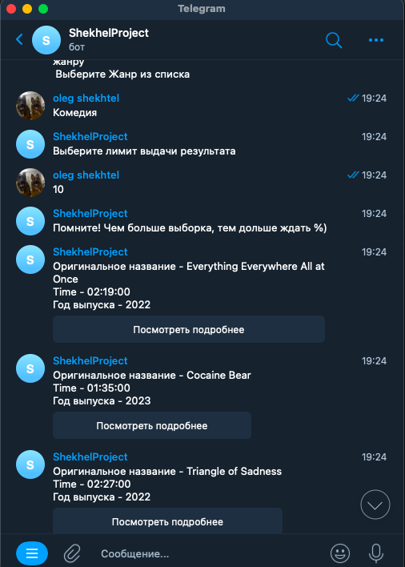
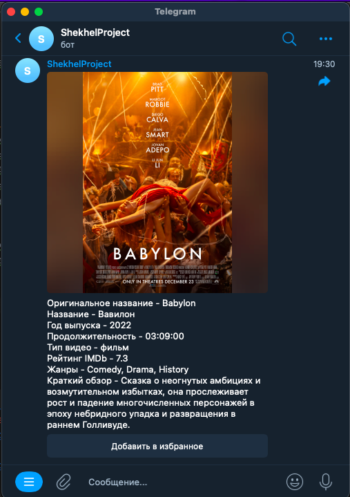

## Чат бот для мессенджера Telegram на основе Request запросов к сервису IMDb

### Данный бот был разработан, в качестве выпускной работы базового курса PYTHON-разработчик цифровой площадки обучения - Skillbox
### При созданье использовались дополнительные материалы для реализации:
#### SQLite - базы данных и как они работают, Aiogram - Пакет взаимодействия с Telegram, PeeWee - ORM для удобного взаимодействия с Базами данных
### Содержание:
1) Архитектура
2) Технологии
3) Основные принципы работы
4) Примеры взаимодействия

#### 1) Архитектура:
Для удобства использования программа была разделена на отдельные директории скомбинированные по признаку общего действия.
1) **_bot_admin_** - Директория с ключевыми файлами для создания экземпляра бота.
   * **config.py** - Функции для изменения заданной конфигурации со значения - defaul до значения заданного разработчиком.
   * **create_bot.py** - Экземпляр бота для взаимодействия Telegramm и кода программы.
   * **other_data.py** - Общее административное хранилище со словарями\картежами\списками для уменьшения строк основного кода программы.

2) **_db_sql_** - Директория с ключевыми файлами для создания\хранения\взаимодействий с базой данных
   * **database** - Место хранения базы данных(SQLite)
   * **db_create.py** - Функции для создания экземпляра базы данных с учетом количества таблиц\столбцов - метод создания ORM _PeeWee_.
   * **db_function.py** - Класс _Function_ - предназначен для взаимодействия с базой данных, а именно чтение и запись данных.

3) **_hendlers_** - Директория с ключевыми файлами для создания блока команд и обработки **_User_** сообщений из Telegram. Методы взаимодействия - **Aiogram**.   
**_hendlers_** это набор функций для взаимодействия с клиентом Telegram, в каждом блоке используется модель Finite-state machine,
позволяющая одновременно хранить состояние каждого пользователя, который взаимодействует с программой. Каждое действие заключено
в собственное состояние не позволяющее перейти к другому этапу без соответствующей команды.
   * **actor.py** - Набор функций для отработки команд по поиску информации об актерах мирового кинематографа.
Также в данном блоке реализована возможность для пользователя - получение полной фильмографии актера.
   * **movie.py** - Набор функций для отработки команд по поиску фильмов исходя из названия от пользователя. 
Также в данном блоке реализован обработчик CallBack сообщений связанных с получением подробной информации\добавление в избранное.
   * **movie_top.py** - Набор функций для отработки команд для выдачи списка(количество задается пользователем) топ фильмов в выбранном жанре.
   * **multiple_handlers.py** - Набор функций для обработки общих команд бота. Таких, как /start, /stop, /help и другие.
   * **translate.py** - Набор функций для обработки команд отдельного блока - Переводчик.
4) **_keyboard_** - Содержит два файла Inlinekeyboard и Replykeyboard, позволяющие создать экземпляры клавиатуры для облегчения взаимодействия с пользователем.
5) **_parsing_** - Директория с ключевыми файлами исполняемого кода GET(POST) запросов к API сервису
   * **search_actor.py, search_movie.py, search_top.py** - Класс функций для отправки get запросов к API IMDb в рамках установленной http сессии.
   * translate.py - Класс функций, также осуществляющий POST запрос, но к API @text-translator@, данные функции используются как самостоятельный блок так и вспомогательный.
6) .env - Переменная окружения, которая содержит в себе исключительно административную информацию о ссылках, ключах активации, занесена в Gitignor.
7) **_main.py_** - основной код для запуска всех взаимодействий и подключение бота к API Telegram.
8) **_requirements.txt_** - текстовый файл с содержанием названий и версий необходимых утилит, используемых при разработке Бота.
Для установки необходимо воспользоваться следующими командами:
   * _python -m pip install -r requirements.txt_ или _pip install -r requirements.txt_

#### 2) Технологии:

При разработке использовались дополнительные утилиты которые не входят в стандартный пакет Python, такие как:

1) requests - утилита позволяющая отправлять\получать get(post) запросы непосредственно к конкретному API сервера. 
Выдача информации приходит словарем, который позволяет удобно вычленить необходимую информацию методами json и методами работы со словарями.
2) python-dotenv - утилита позволяющая найти и изъять информацию из переменной окружения без использования пути к файлу, тоесть она самостоятельно сканирует общую директорию на предмет переменной.
3) aiogram - набор функций и модулей для создания взаимодействий бота, и сообственно самого экзепляра бота, крайне ёмкая утилита.
в текущей реализации затронуты только некоторые части, что в последствии позволяет расширить функционал существующего бота.
4) peewee - легкая ORM для взаимодействия с базами данных, таких как SQLite, PostgreSQL.
Взаимодействие происходит на уровне отдельных классов и методов, что позволяет уменьшить исполняемый код и исключить ошибки в написание sql команд.

### 3) Основные принципы работы:

При исполнении основного кода из файла _main.py_ происходит подключение к _Api telegram_, подключение к уже созданной или создание базы данных.
При удачном запуске, d окне консоли(если запуск консольный) появляется соответсвующая информация об успешном запуске. Чат бот переходит в режим ожидания взаимодействия с пользователем.
Библиотека Aiogram позволяет формировать асинхронные функции, то-есть функции которые могут быть исполнены в определенных условиях, а не по порядку.
Но взаимодействие с пользователем в каждом блоке бота все равно идет по определенному сценарию. При выборе команды пользователь получает запрос от бота, 
что необходимо сделать, в случае правильного ответа пользователя машина переходит к следующему состоянию, либо выдает результат.
При исполнении команд, бот взаимодействует с основным кодом программы и получает данные от других сервисов, естественно на обработку команд требуется время и пользователь
получает об этом уведомление. На каждом этапе взаимодействия у пользователя есть возможность прервать цикл работы, или перейти в другой блок
взаимодействий, но для этого необходимо остановить текущий цикл, если такой запущен.
При запуске каждого блока, в базу данных автоматически сохраняется история взаимодествий пользователя с ботом, впоследствии пользователь
может запросить историю. Так же в базе данных на постоянной основе(если база не будет удалена) хранится информация о добавленных избранных фильмах.

### 4) Примеры взаимодействия:

При запуске бота пользователю приходит сообщение с основными командами:

Так же у пользователя есть дополнительное меню с командами бота:

Рассмотрим пример поиска топ фильмов по жанрам, при использование команды пользователь получает подсказку:

В результате взаимодействия пользователю приходит ряд сообщений с Топ фильмами, у каждого сообщения есть возможность посмотреть подробности о картине:

Результат использования кнопки - Подробнее:

